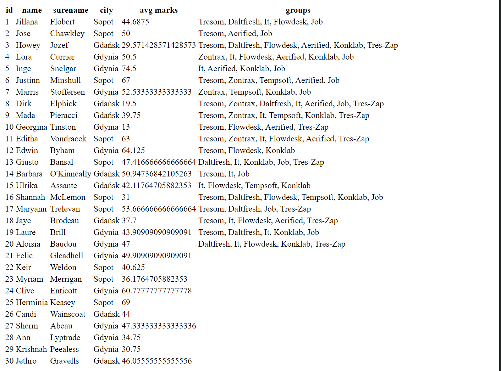

Challenge 1
Wykorzystaj pobrane z serwera dane studentów i wyświetl na stronie listę imion studentów.

Challenge 2
Zastąp listę studentów tabelą i w osobnych kolumnach wyświetl wartości atrybutów: id, name, surname oraz city.

Hints
wykorzystaj znaczniki `<table>, <thead>, <tbody>, <tr>, <th> oraz <td>`

Challenge 3
W danych studentów znajduje się pole z ich ocenami. Każdy ze studentów posiada pole grades. Jego wartością jest tablica obiektów. Każdy z tych obiektów posiada 2 atrybuty: value oraz date.

Dodaj do tabeli z poprzedniego kroku kolumnę, w której wyświetlisz średną ocen danego studenta. Oceny podane są procentowo (wartości 0 - 100).

Challenge 4
W pliku ./data/groups.json znajdują się dane grup studenckich. Każdy ze studentów może przynależeć do kilku grup alub nie przynależeć do żadnej.

Dodaj w tabeli kolumnę, w które wypisane będą nazwy wszystkich grup, do których przynależy dany student.