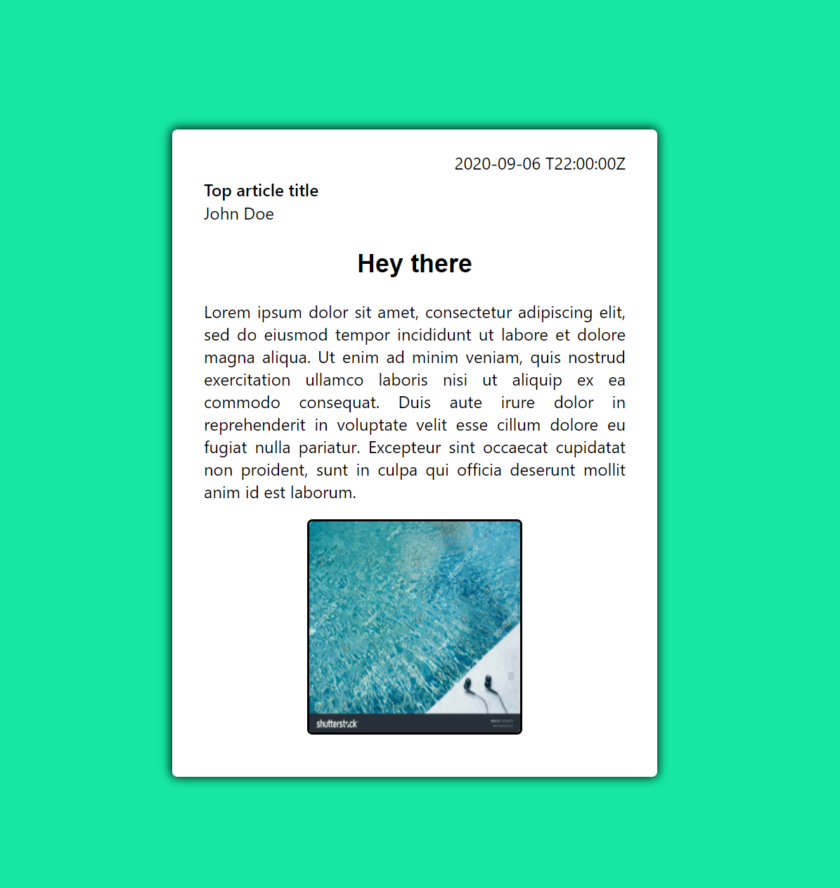
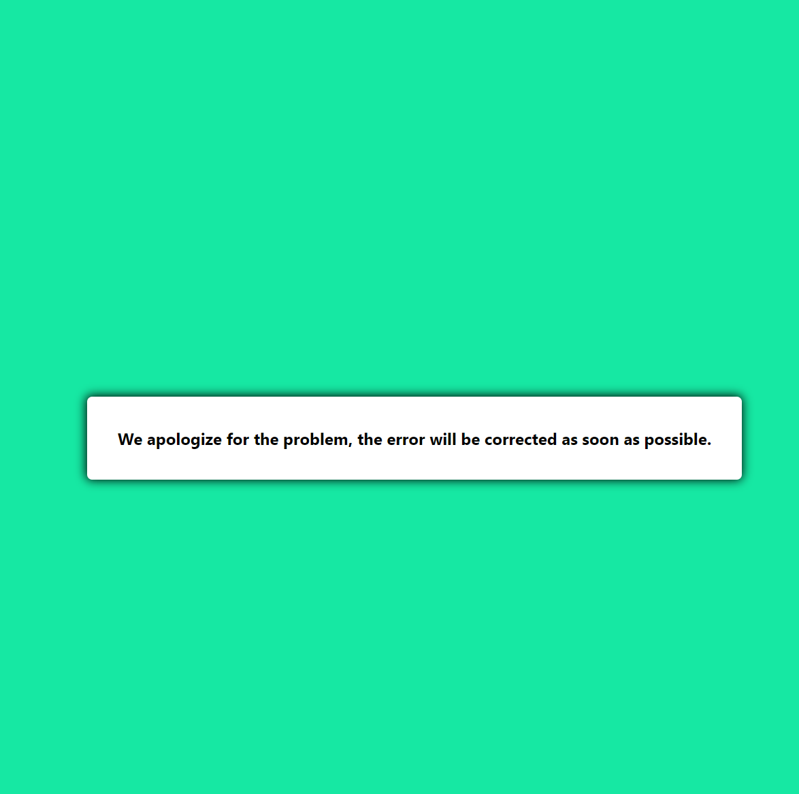

<h2>The application is downloaded from an external JSON file and then displayed as a post.</h2>

<h3>Screen from app when its fine</h3>

<h3>Screen from app when data doesn't upload to the app </h3>

