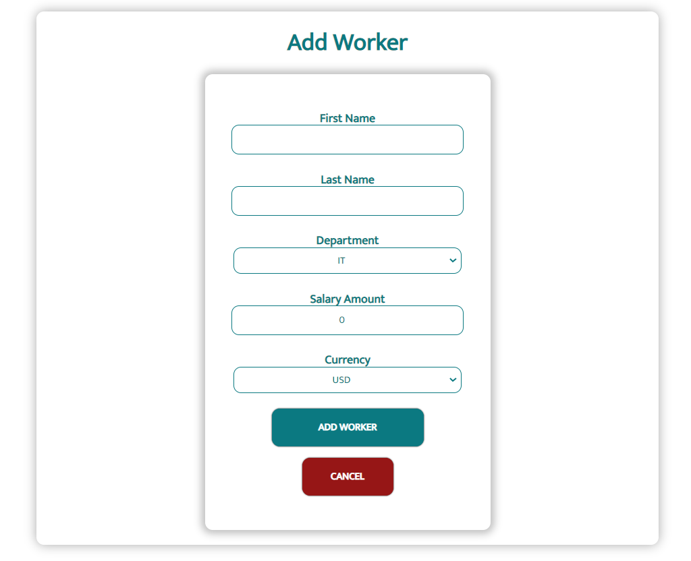
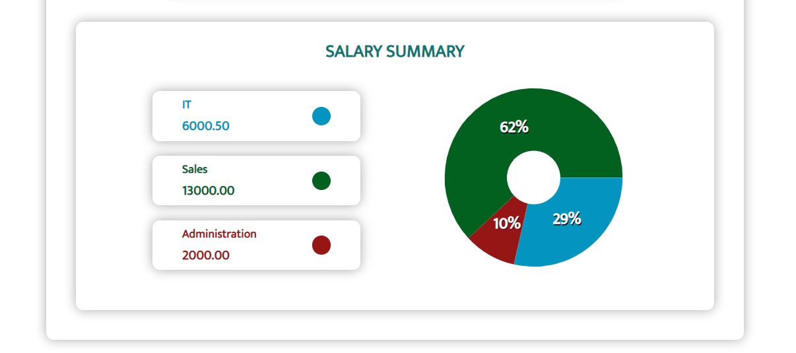
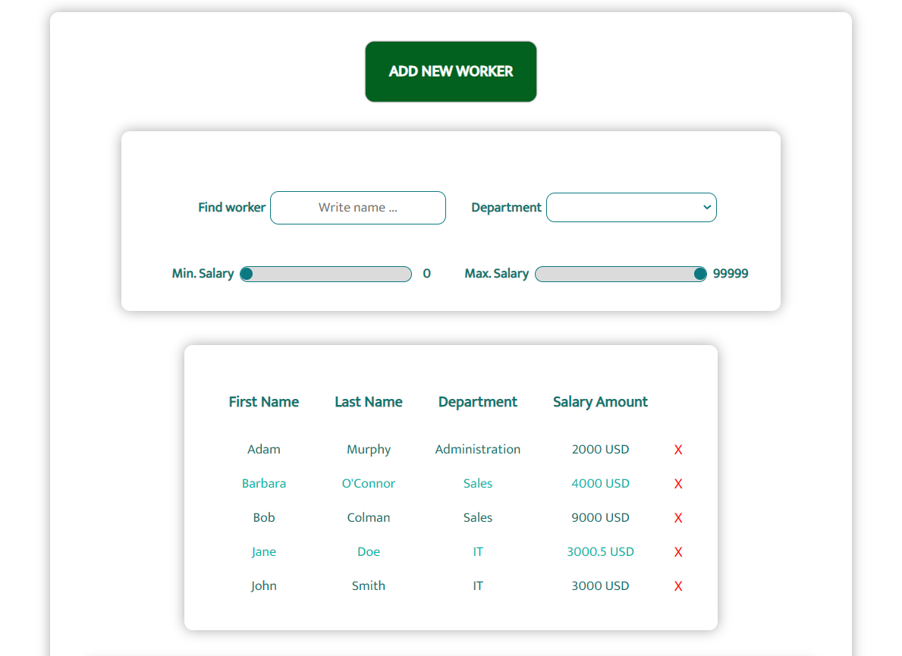

# how to start applications?

1. Download the data to your computer
2. Enter the command "npm install"
3. Download styled-components, enter the command "npm i styled-components"
4. Enter another command "npm install --save @types/styled-components"
5. Run a server, write command "json-server .\data\db.json --port 3000"
6. Run App "npm start"

# Youtube

https://www.youtube.com/watch?v=jrgtxPlAX-U

# Images from project

