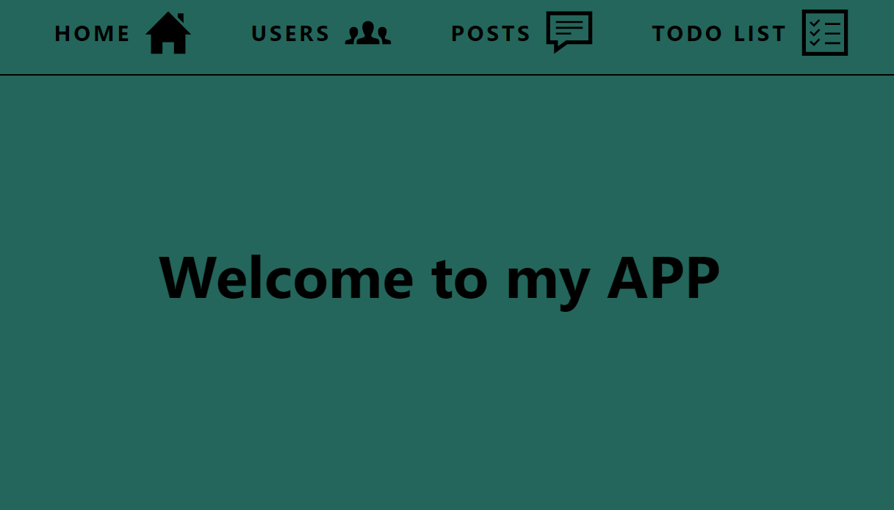
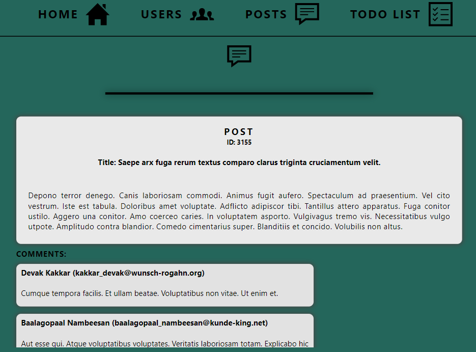
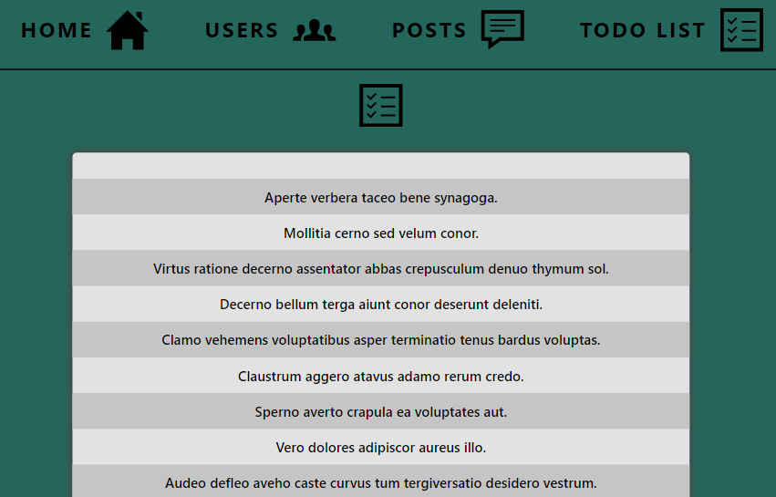
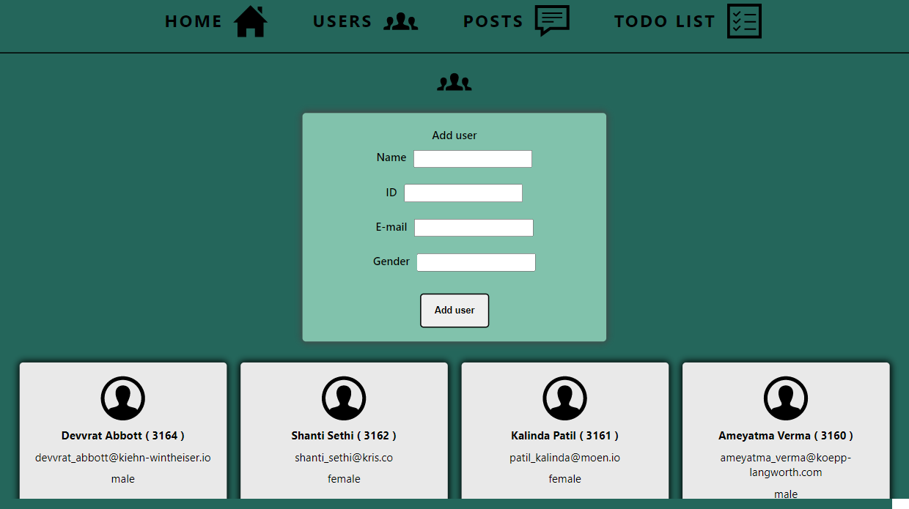

1. The task is to implement a Web application using the React framework, which will present data downloaded using REST API from an external server available at the URL: https://gorest.co.in/public/

2. The application consists of 3 subpages:

• Users The subpage presents information about users downloaded from the API: https://gorest.co.in/public/v1/users

• Posts The subpage presents posts downloaded from the API: https://gorest.co.in/public/v1/posts along with comments related to the post, which are available at the URL: https://gorest.co.in/public/ v1 / comments

• The Todos subpage presents a list of to-do tasks retrieved from the URL: https://gorest.co.in/public/v1/todos.

